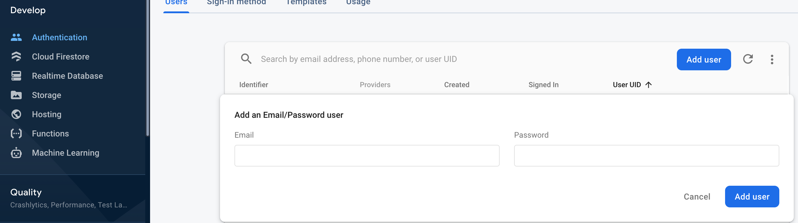
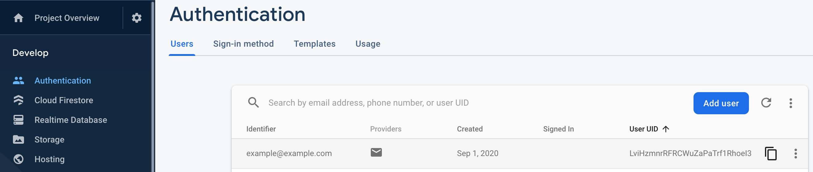
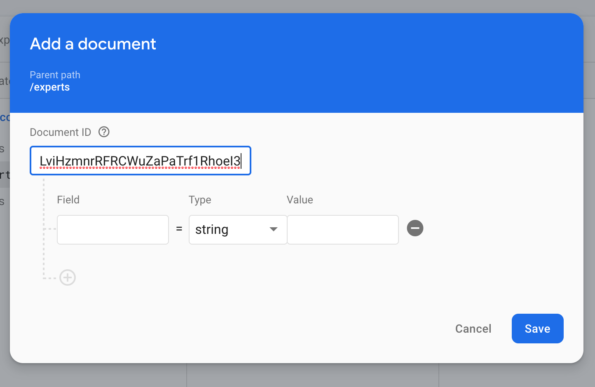
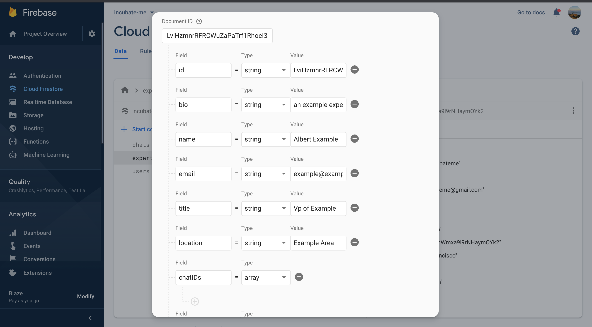
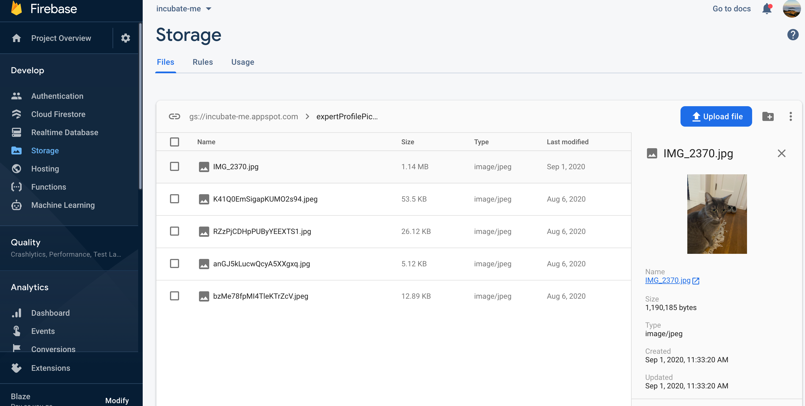
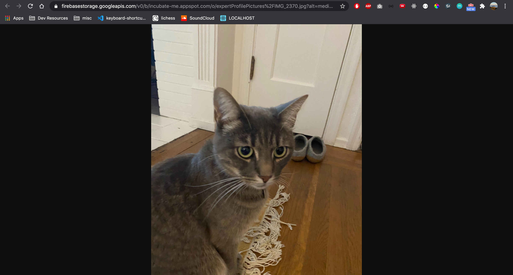
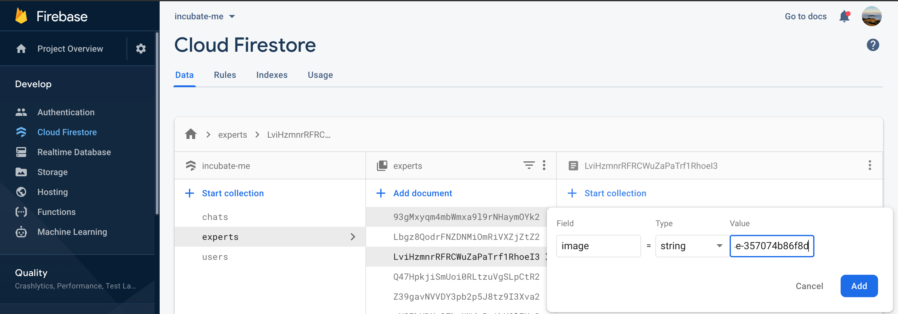
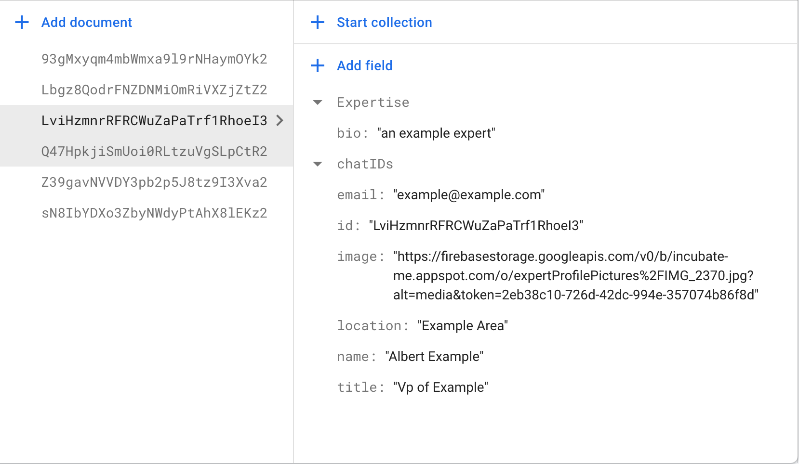

## Incubate-me web app
***
*Author:* Trevor Shepard  
*Created:* 09/01/2020  
*Version:* 1.0.1  

## Installation
* Clone the code:
    * `git clone https://github.com/trevor-shepard/incubate-me-web && cd tdr`
* Initialize install dependencies.
    * `npm install`
* Run the server on localhost:3000
    * `npm start`

## Database Structure (collections)
* Users
     ```
        username: string
        uid: string
        email: string
        linkedIn: string
        companyUrl: string
        fundingStage: 'self/family' | 'bank' | 'angel' | 'seed' | 'series-a' | 'other'
        services: {
            accounting: boolean
            humanResource: boolean
            stratigicFinance: boolean
        }
        neededExpertise: {
            bookKeeping: boolean
            accounting: boolean
            cpa: boolean
            tresauryManagment: boolean
            paymentManagement: boolean
            receivablesManagment: boolean
            fluxAnalysisOfMonthlyFinancialStatements: boolean
            budgetingPlanning: boolean
            financialModeling: boolean
            alternativeFinancingGovFinancing: boolean
            CFOAdvisory: boolean
            Management1099: boolean
            w2Onboarding: boolean
            payrollManagment: boolean
            healthcareManagment: boolean
        }
        expertIDs: string[]
* Experts
     ```
        bio: string
        id: string
        name: string
        email: string
        title: string
        location: string
        expertise: string[]
        chatIDs: string[]
        image: string
        linkedInProfile?: string (optional field)
* Chats (conversation is subcollection, will be missing in the database if no messages have been sent)
     ```
        id: string
        participants: {
            [userID: string]: string (string representation of date)
        }
        conversation {
            [id: string]: {
                senderID: string
                text: string
                date: string (string representation of date)
                id: string
            }
        }

## To Add an Expert
* Add an authentication user in the admin pannel 
  * 
* Copy Auth user Uid  
  * 
* Add document with the id of copied uid to experts collection in Cloud Firestore
  * 
* Add all required fields except for image, chatIDs must be empty array
  * 
* Add the experts profile picture to the folder expertProfilePictures/ in the storage bucket
  * 
* Click the link under name of the photo and copy the url
  * 
* Add the url to the expert document under the field `image`
  * 
* Final document should look like this
  * 
